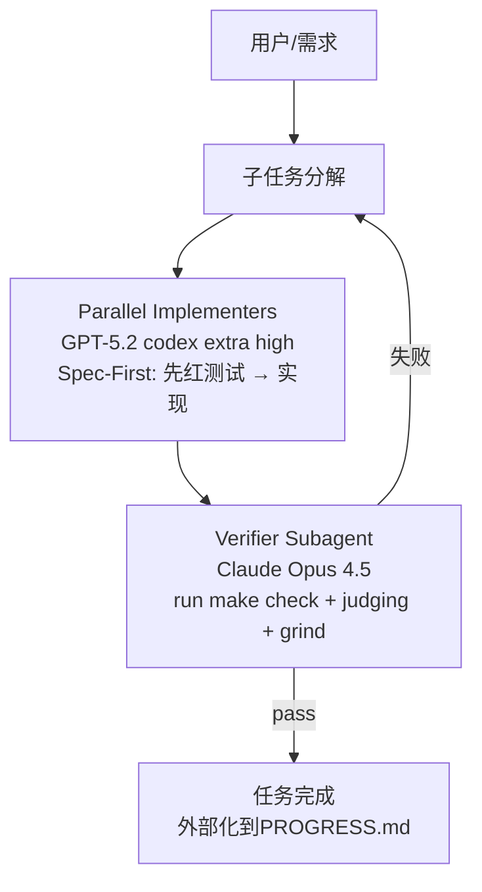

# 项目总述 (Project Overview)

## 目录

- [1. 项目简介](#1-项目简介)
- [2. 核心理念](#2-核心理念)
- [3. 配置结构](#3-配置结构)
- [4. 关键特性](#4-关键特性)
- [5. 使用指南](#5-使用指南)

## 1. 项目简介

**SynchroRig** 是一个 Cursor IDE 专用的 Subagents 工作流模板，专为 Vibe Coding 设计。它的核心使命是解决手动prompt模拟Agent协作导致的低效问题—— **token浪费、上下文漂移、粒度失控、返工循环** 。

在传统Cursor Agent使用中，开发者往往通过角色扮演prompt手动实现开发/验收循环，容易导致任务拆分不均、测试标准模糊。本模板利用Cursor原生Subagents、Skills、Rules，通过 **Planner-Implementers-Verifier** 结构，实现Spec-First TDD驱动的自主闭环开发：Agent先写红测试验证需求→并行实现→自动化验收grind直到全绿。

简单来说，它就像一个内置的产品级代码工程师，强制测试先行、风险自适应并行、自动迭代直到pass，帮助你高效完成PR粒度任务。

## 2. 核心理念

本模板的设计遵循以下几个核心理念：

- **原生优先 (Native First)** ：杜绝手动角色扮演，直接复用Cursor Subagents并行执行与Verifier grind机制，避免重复造轮子。
- **Spec-First TDD (Test-Driven Development)** ：需求不是直接实现，而是先写“会失败的测试用例”验证红→实现变绿→全check pass，确保验收标准客观。
- **粒度锚点 (PR-Sized Granularity)** ：任务严格对齐软件工程PR/CL标准（100-300 LOC，≤10文件，单一意图、可独立验证），结合风险动态并行N。
- **自动化闭环 (Automated Loop)** ：Verifier skill脚本运行make check，失败自动反馈/子任务分解/迭代，直到"All checks passed!"。
- **上下文外置 (Externalized Memory)** ：关键决策、接口契约、进度状态写入物理文件（如PROGRESS.md），防止lost-in-the-middle。

## 3. 配置结构

模板采用项目级.cursor文件夹配置，各组件职责分离。

### 3.1 整体工作流图

### 3.2 组件详解
1. Rules (.cursor/rules/)

职责 : 系统级约束，强制粒度、TDD、外置记忆。
关键文件 :
tdd.mdc : "始终Spec-First: 先写并验证红测试，再实现直到绿；关键信息写入PROGRESS.md。"

2. Subagents (.cursor/agents/)

planner.md : 轻量模型（推荐Claude Haiku或GPT-4o mini），负责hierarchical decomposition到PR粒度、风险评估（低/中/高）、动态路由parallel N（1/2/3-5）。
implementers.md : model: GPT-5.2 codex extra high，parallel: dynamic（由planner决定），prompt强制"先写pytest红测试，自行run make test验证失败，再实现"。
verifier.md : model: Claude Opus 4.5，invoke verification skill，grind until "All checks passed!"，judging多实现选优。

3. Skills (.cursor/skills/)

verification/SKILL.md : 包含scripts/run-check.sh（执行make check），instructions: "解析输出；若红验证失败重试；若全失败触发sub-tasking；选优报告证据"。

4. 示例基础设施

Makefile : 定义check（ruff/biome + pytest）、test（纯pytest）。
tests/ : 最小demo红/绿测试示例。
PROGRESS.md / SUMMARY.md : 大任务运行中的外部化记忆与进度条（初始化 + 动态追加写入）。

## 5. 使用方式（大任务入口）

你只需要在 Agent Chat 里输入“大任务需求”（不要手动调用任何 subagent）。
工作流会自动：

- 初始化（覆盖重写）`SUMMARY.md` 与 `PROGRESS.md`
- 调用 `/planner` 拆分为 PR-sized 子任务
- 按每个子任务的 `parallel_count` 调用 `/implementers` 并行产出候选实现
- 调用 `/verifier` 通过 verification skill 进行机器验收，并 grind 直到 `All checks passed!`
- 在每一步把运行日志与证据动态写入 `SUMMARY.md` 与 `PROGRESS.md`

## 4. 关键特性

自主任务拆分 ：Planner自动hierarchical decompose + 风险自适应N路并行，无需手动干预。
自动化红/绿验证 ：Implementers自行run测试，Verifier脚本解析机器反馈，杜绝“假测试”。
Grind迭代 ：失败时自动子任务分解或重试，直到全check pass，减少手动返工。
外部记忆持久化 ：Rules强制关键信息写入.md文件，支持长运行项目。
模型专化 ：开发用GPT-5.2 codex高码能力，验收用Claude Opus 4.5严谨judging。

## 5. 使用指南

1. 克隆本仓库到本地。
2. 将 `template-cursor/` 复制到项目根并重命名为 `.cursor/`（Windows: `Copy-Item -Recurse -Force .\template-cursor .\.cursor`；Linux/Mac: `cp -r template-cursor .cursor`）。
3. 在 Cursor 中打开项目，确认 Subagents / Skills / Rules 已加载。
4. 配置模型：Settings → Models，为各 subagent 选择对应模型（见 `template-cursor/agents/`）。
5. 创建或沿用 `Makefile` 与 `tests/`（本仓库含示例）。
6. 在 Agent Chat 中直接输入大任务需求，由 Orchestrator 自动调用 planner → implementers → verifier。
7. 运行 `make check` 验证环境；给一个小需求可观察完整 cycle。
